# 有趣的树

刚好这两周的算法课讲了树的问题，所以索性在这里做一个完整的学习以及总结，包括树的概念、原理、变种、应用等等。

**所选用的编程语言**

- Python

## 一、什么是树？

### 1.1 树的定义

在计算机科学中，树（tree）是一种抽象数据类型或是实现这种抽象数据类型的数据结构，用来模拟具有树状结构性质的数据集合。它是由n（n>0）个有限节点组成一个具有层次关系的集合。把它叫做“树”是因为它看起来像一棵倒挂的树，也就是说它是根朝上，而叶朝下的。它具有以下的特点：

1. 每个节点有零个或多个子节点；
2. 没有父节点的节点称为根节点；
3. 每一个非根节点有且只有一个父节点；
4. 除了根节点外，每个子节点可以分为多个不相交的子树；


**节点**：树的基本部分。它可以有一个名称，我们称之为“键”。节点也可以有附加信息。我们将这个附加信息称为“有效载荷”。虽然有效载荷信息不是许多树算法的核心，但在利用树的应用中通常是关键的。

**节点的度**：一个节点含有的子树的个数称为该节点的度；

**树的度**：一棵树中，最大的节点的度称为树的度；

**叶节点或终端节点**：度为零的节点；

**父亲节点或父节点**：若一个节点含有子节点，则这个节点称为其子节点的父节点；

**孩子节点或子节点**：一个节点含有的子树的根节点称为该节点的子节点；

**兄弟节点**：具有相同父节点的节点互称为兄弟节点；

**节点的层次**：从根开始定义起，根为第1层，根的子节点为第2层，以此类推；

**树的高度或深度**：树中节点的最大层次；

**堂兄弟节点**：父节点在同一层的节点互为堂兄弟；

**节点的祖先**：从根到该节点所经分支上的所有节点；

**子孙**：以某节点为根的子树中任一节点都称为该节点的子孙。

**森林**：由m（m>=0）棵互不相交的树的集合称为森林；

### 1.2 树的种类

- **无序树**：树中任意节点的子节点之间没有顺序关系，这种树称为无序树，也称为自由树；
- **有序树**：树中任意节点的子节点之间有顺序关系，这种树称为有序树；
    - **二叉树**：每个节点最多含有两个子树的树称为二叉树；
        - **完全二叉树**：对于一颗二叉树，假设其深度为d(d>1)。除了第d层外，其它各层的节点数目均已达最大值，且第d层所有节点从左向右连续地紧密排列，这样的二叉树被称为完全二叉树，其中**满二叉树**的定义是所有叶节点都在最底层的完全二叉树;
        - **平衡二叉树**（AVL树）：当且仅当任何节点的两棵子树的高度差不大于1的二叉树；
        - **排序二叉树**（二叉查找树（英语：Binary Search Tree），也称二叉搜索树、有序二叉树）；
    - **霍夫曼树**（用于信息编码）：带权路径最短的二叉树称为哈夫曼树或最优二叉树；
    - **B树**：一种对读写操作进行优化的自平衡的二叉查找树，能够保持数据有序，拥有多余两个子树。

### 1.3 树的存储与表示

**顺序存储**：将数据结构存储在固定的数组中，然在遍历速度上有一定的优势，但因所占空间比较大，是非主流二叉树。二叉树通常以链式存储。

<center>


</center>

**链式存储**：

<center>


</center>

由于对节点的个数无法掌握，常见树的存储表示都转换成二叉树进行处理，子节点个数最多为2

### 1.4 树的特殊定义

定义一：树由一组节点和一组连接节点的边组成。树具有以下属性：

- 树的最顶端的第一个节点被指定为根节点。
- 除了根节点之外，每个节点 n 通过一个其他节点 p 的边连接，其中 p 是 n 的父节点。
- 从根路径遍历到每个节点路径唯一。
- 如果树中的每个节点最多有两个子节点，我们说该树是一个二叉树。下图展示了合适定义一的。

<center>

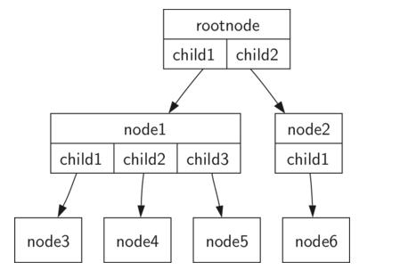

</center>

定义二：树是空的，或者由一个根节点和零个或多个子树组成，每个子树也是一棵树。每个子树的根节点通过边连接到父树的根节点。 下图展现了树的这种递归定义。通过树的递归定义，我们知道图中的树至少有四个节点，因为表示一个子树的每个三角形必须有一个根节点。 

<center>

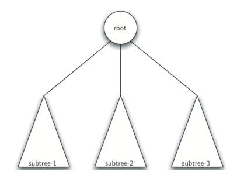

</center>

### 1.5 树结构的代码实现

**树的节点类TreeNode**

```python
'''
name: 当前节点的名字（使用str来保存）
parent: 父节点对象（对根节点来说，该值为Null）
child: 字节点对象们（使用dict来保存）
'''
class TreeNode(object):
    """The basic node of tree structure"""

    def __init__(self, name, parent=None):
        super(TreeNode, self).__init__()
        self.name = name
        self.parent = parent
        self.child = {}

    def __repr__(self) :
        return 'TreeNode(%s)' % self.name
```

**树节点操作方法**

对于树中节点的操作：
- get_child(name) 获取子节点 （仅在当前节点下）
- find_child(name/path) 查找子节点（甚至子节点的子节点的…子节点）
- add_child(name, obj) 增加子节点
- del_child(name) 删除子节点
```python
class TreeNode(object):

    def get_child(self, name, defval=None):
        """get a child node of current node"""
        return self.child.get(name, defval)

    def add_child(self, name, obj=None):
        """add a child node to current node"""
        if obj and not isinstance(obj, TreeNode):
            raise ValueError('TreeNode only add another TreeNode obj as child')
        if obj is None:
            obj = TreeNode(name)
        obj.parent = self
        self.child[name] = obj
        return obj

    def del_child(self, name):
        """remove a child node from current node"""
        if name in self.child:
            del self.child[name]

    def find_child(self, path, create=False):
        """find child node by path/name, return None if not found"""
        # convert path to a list if input is a string
        path = path if isinstance(path, list) else path.split()
        cur = self
        for sub in path:
            # search
            obj = cur.get_child(sub)
            if obj is None and create:
                # create new node if need
                obj = cur.add_child(sub)
            # check if search done
            if obj is None:
                break
            cur = obj
        return obj
``` 

**打印树的结构**

```python
class TreeNode(object):

    def dump(self, indent=0):
        """dump tree to string"""
        tab = '    '*(indent-1) + ' |- ' if indent > 0 else ''
        print('%s%s' % (tab, self.name))
        for name, obj in self.items():
            obj.dump(indent+1)
```

### 1.6 一些常见树的应用场景

1.xml，html等，那么编写这些东西的解析器的时候，不可避免用到树
2.路由协议就是使用了树的算法
3.mysql数据库索引
4.文件系统的目录结构
5.所以很多经典的AI算法其实都是树搜索，此外机器学习中的decision tree也是树结构

## 二、 二叉树

### 2.1 二叉树的基本概念

二叉树：每个节点最多有两个子树的树结构。通常字数被称作“左子树”（left subtree）和“右子树”（right subtree）。

### 2.2 二叉树的性质（特性）

1. 在二叉树的第i层上至多有2^(i-1)个结点（i>0）
2. 深度为k的二叉树至多有2^k - 1个结点（k>0）
3. 对于任意一棵二叉树，如果其叶结点数为N0，而度数为2的结点总数为N2，则N0=N2+1;
4. 具有n个结点的完全二叉树的深度必为 log2(n+1)
5. 对完全二叉树，若从上至下、从左至右编号，则编号为i 的结点，其左孩子编号必为2i，其右孩子编号必为2i＋1；其双亲的编号必为i/2（i＝1 时为根,除外）

（1）完全二叉树——若设二叉树的高度为h，除第h层外，其他各层（1~h-1）的结点数都达到最大个数，第h层有叶子结点，并且叶子结点都是从左到右依次排序，这就是完全二叉树。

<center>


</center>

(2)满二叉树——除了叶结点外每一个结点都有左右子叶且叶子结点都处在最底层的二叉树。

<center>


</center>

### 2.3 二叉树的遍历

树的遍历是树的一种重要的运算。所谓遍历是指对树中所有结点的信息的访问，即依次对树中每个结点访问一次且仅访问一次，我们把这种对所有节点的访问称为遍历（traversal）。那么树的两种重要的遍历模式是深度优先遍历和广度优先遍历,**深度优先一般用递归，广度优先一般用队列。一般情况下能用递归实现的算法大部分也能用堆栈来实现。**


<center>

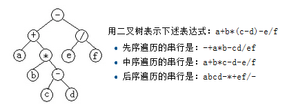

</center>

### 2.4 深度优先遍历与广度优先搜索

**深度优先遍历**

对于一颗二叉树，深度优先搜索(Depth First Search)是沿着树的深度遍历树的节点，尽可能深的搜索树的分支。
那么深度遍历有重要的三种方法。这三种方式常被用于访问树的节点，它们之间的不同在于访问每个节点的次序不同。这三种遍历分别叫做先序遍历（preorder），中序遍历（inorder）和后序遍历（postorder）。我们来给出它们的详细定义，然后举例看看它们的应用。

先序遍历：先根节点->遍历左子树->遍历右子树

```python
def preorder(self, root):
      """递归实现先序遍历"""
      if root == None:
          return
      print root.elem
      self.preorder(root.lchild)
      self.preorder(root.rchild)
```

中序遍历：遍历左子树->根节点->遍历右子树

```python
def inorder(self, root):
      """递归实现中序遍历"""
      if root == None:
          return
      self.inorder(root.lchild)
      print root.elem
      self.inorder(root.rchild)
```

后序遍历：遍历左子树->遍历右子树->根节点

```python
def postorder(self, root):
      """递归实现后续遍历"""
      if root == None:
          return
      self.postorder(root.lchild)
      self.postorder(root.rchild)
      print root.elem
```

**广度优先遍历（层次遍历）**

从树的root开始，从上到下从从左到右遍历整个树的节点

```python
def breadth_travel(self, root):
        """利用队列实现树的层次遍历"""
        if root == None:
            return
        queue = []
        queue.append(root)
        while queue:
            node = queue.pop(0)
            print node.elem,
            if node.lchild != None:
                queue.append(node.lchild)
            if node.rchild != None:
                queue.append(node.rchild)
```

<center>

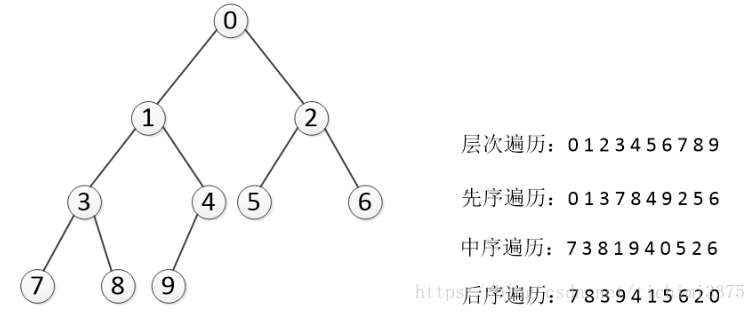

</center>

### 2.5 二叉树实现代码

二叉树的创建

```python
'''
通过使用Node类中定义三个属性，分别为elem本身的值，还有lchild左孩子和rchild右孩子
'''
class Node(object):
    """节点类"""
    def __init__(self, elem=-1, lchild=None, rchild=None):
        self.elem = elem
        self.lchild = lchild
        self.rchild = rchild
```

```python
'''
树的创建,创建一个树的类，并给一个root根节点，一开始为空，随后添加节点
'''
class Tree(object):
    """树类"""
    def __init__(self, root=None):
        self.root = root
 
    def add(self, elem):
        """为树添加节点"""
        node = Node(elem)
        #如果树是空的，则对根节点赋值
        if self.root == None:
            self.root = node
        else:
            queue = []
            queue.append(self.root)
            #对已有的节点进行层次遍历
            while queue:
                #弹出队列的第一个元素
                cur = queue.pop(0)
                if cur.lchild == None:
                    cur.lchild = node
                    return
                elif cur.rchild == None:
                    cur.rchild = node
                    return
                else:
                    #如果左右子树都不为空，加入队列继续判断
                    queue.append(cur.lchild)
                    queue.append(cur.rchild)
```

## 三、 动态查找树

### 3.1 二叉查找树

二叉查找树是二叉树的衍生概念：

二叉查找树（英语：Binary Search Tree），也称为二叉搜索树、有序二叉树（ordered binary tree）或排序二叉树（sorted binary tree），是指一棵空树或者具有下列性质的二叉树：

    1.若任意节点的左子树不空，则左子树上所有节点的值均小于它的根节点的值；
   2. 若任意节点的右子树不空，则右子树上所有节点的值均大于它的根节点的值；
    3.任意节点的左、右子树也分别为二叉查找树；
    4.没有键值相等的节点。

二叉查找树相比于其他数据结构的优势在于查找、插入的时间复杂度较低为 O ( log ⁡ n ) 。二叉查找树是基础性数据结构，用于构建更为抽象的数据结构，如集合、多重集、关联数组等。

以下是代码实现：
```python
class Node:
    '''
    define Node
    key:The value of node.
    left:The left subtree ,inital is none.
    right:The right of subtree,inital is none.
    '''
    def __init__(self,key,left=None,right=None):
        self.key = key
        self.left = left
        self.right = right
            
class Tree:
    def __init__(self):
        self.root = None
        
    def add(self, x,listCompare2):
        node = Node(x)
        if self.root is None:
            self.root = node
            #print (self.root.key)
            return listCompare2
        else:
            y = self.root
            #print (y)
            while True:
                #print(y.key)
                if  y.key > node.key:
                   # print(y)
                    #listCompare2.append({node.key,y.key})
                    if y.left == None:
                        y.left = node
                        return listCompare2
                    else:
                        y = y.left
                else:
                    if y.right == None:
                        listCompare2.append({y.key,node.key})
                        y.right = node
                        return listCompare2
                    else:
                        y = y.right
```

从上面的程序我们可以看出，二叉树的实现（add）操作，它是和数据的排列顺序有关系的，在最好的情况下即二叉树为平衡二叉树的时候：这棵树的高度为：H = log(N);N为这个树的所有节点数。但是在最差的时候即插入时数据是有序的那么在这种情况下树的高度就是：N了
这样二叉树的建立就影响到二叉树的基本操作：查询。它取决于树的结构了。


### 3.2 平衡二叉树（AVL树）

平衡二叉树：当且仅当任何节点的两棵子树的高度差不大于1的二叉树；

其中AVL树是最先发明的自平衡二叉查找树，是最原始典型的平衡二叉树。

平衡二叉树是基于二叉查找树的改进。由于在某些极端的情况下（如在插入的序列是有序的时），二叉查找树将退化成近似链或链，此时，其操作的时间复杂度将退化成线性的，即O(n)。所以我们通过自平衡操作（即旋转）构建两个子树高度差不超过1的平衡二叉树。


### 3.3 红黑树

红黑树也是一种自平衡的二叉查找树。

1. 每个结点要么是红的要么是黑的。（红或黑）
2. 根结点是黑的。  （根黑）
3. 每个叶结点（叶结点即指树尾端NIL指针或NULL结点）都是黑的。  （叶黑）
4. 如果一个结点是红的，那么它的两个儿子都是黑的。  （红子黑）
5. 对于任意结点而言，其到叶结点树尾端NIL指针的每条路径都包含相同数目的黑结点。（路径下黑相同）

从性质5可以推断出性质5.1：如果一个节点存在黑子节点，那么该节点肯定有两个子结点。


<center>

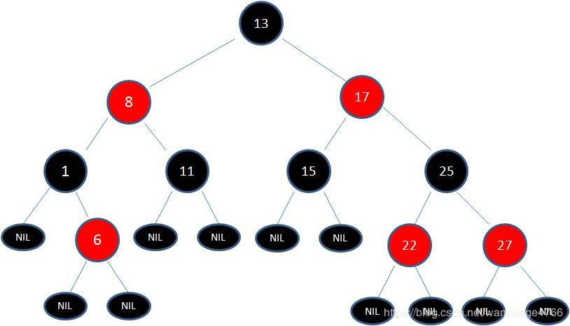

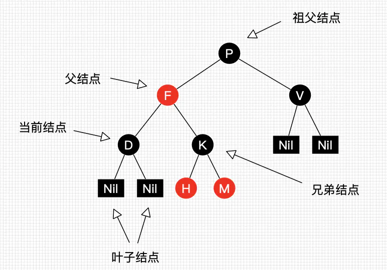

</center>

如图就是一棵典型的红黑树。保证红黑树满足它的基本性质，就是在调整数据结构自平衡。

而红黑树自平衡的调整操作方式就有旋转和变色两种。

**旋转**

- 左旋：以某个结点作为支点(旋转结点)，其右子结点变为旋转结点的父结点，右子结点的左子结点变为旋转结点的右子结点，左子结点保持不变。如图3。
- 右旋：以某个结点作为支点(旋转结点)，其左子结点变为旋转结点的父结点，左子结点的右子结点变为旋转结点的左子结点，右子结点保持不变。如图4。
- 变色：结点的颜色由红变黑或由黑变红。


<center>


左旋


右旋

</center>

上面所说的旋转结点也即旋转的支点，左旋图和右旋图中的P结点。
我们先忽略颜色，可以看到旋转操作不会影响旋转结点的父结点，父结点以上的结构还是保持不变的。
左旋只影响旋转结点和其右子树的结构，把右子树的结点往左子树挪了。
右旋只影响旋转结点和其左子树的结构，把左子树的结点往右子树挪了。

所以旋转操作是局部的。另外可以看出旋转能保持红黑树平衡的一些端详了：当一边子树的结点少了，那么向另外一边子树“借”一些结点；当一边子树的结点多了，那么向另外一边子树“租”一些结点。

但要保持红黑树的性质，结点不能乱挪，还得靠变色了。怎么变？具体情景又不同变法，后面会具体讲到，现在只需要记住红黑树总是通过旋转和变色达到自平衡。

**查找**

因为红黑树是一颗二叉平衡树，并且查找不会破坏树的平衡，所以查找跟二叉平衡树的查找无异：

1. 从根结点开始查找，把根结点设置为当前结点；
2. 若当前结点为空，返回null；
3. 若当前结点不为空，用当前结点的key跟查找key作比较；
4. 若当前结点key等于查找key，那么该key就是查找目标，返回当前结点；
5. 若当前结点key大于查找key，把当前结点的左子结点设置为当前结点，重复步骤2；
6. 若当前结点key小于查找key，把当前结点的右子结点设置为当前结点，重复步骤2；

如图所示。

<center>

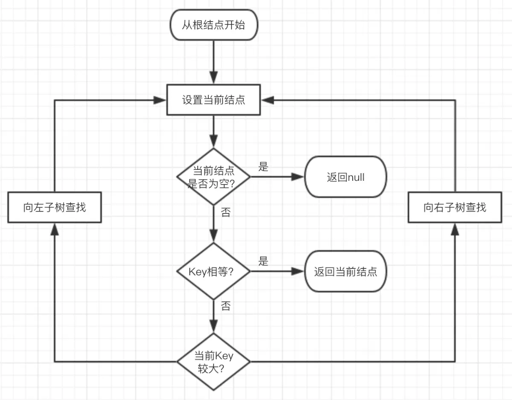

</center>

非常简单，但简单不代表它效率不好。正由于红黑树总保持黑色完美平衡，所以它的查找最坏时间复杂度为O(2lgN)，也即整颗树刚好红黑相隔的时候。能有这么好的查找效率得益于红黑树自平衡的特性，而这背后的付出，红黑树的插入操作功不可没～

**插入**

插入操作包括两部分工作：一查找插入的位置；二插入后自平衡。查找插入的父结点很简单，跟查找操作区别不大：

1. 从根结点开始查找；
2. 若根结点为空，那么插入结点作为根结点，结束。
3. 若根结点不为空，那么把根结点作为当前结点；
4. 若当前结点为null，返回当前结点的父结点，结束。
5. 若当前结点key等于查找key，那么该key所在结点就是插入结点，更新结点的值，结束。
6. 若当前结点key大于查找key，把当前结点的左子结点设置为当前结点，重复步骤4；
7. 若当前结点key小于查找key，把当前结点的右子结点设置为当前结点，重复步骤4；

如图所示。

<center>


</center>

插入位置已经找到，把插入结点放到正确的位置就可以啦，但插入结点是应该是什么颜色呢？答案是红色。理由很简单，红色在父结点（如果存在）为黑色结点时，红黑树的黑色平衡没被破坏，不需要做自平衡操作。但如果插入结点是黑色，那么插入位置所在的子树黑色结点总是多1，必须做自平衡。

插入情况

<center>

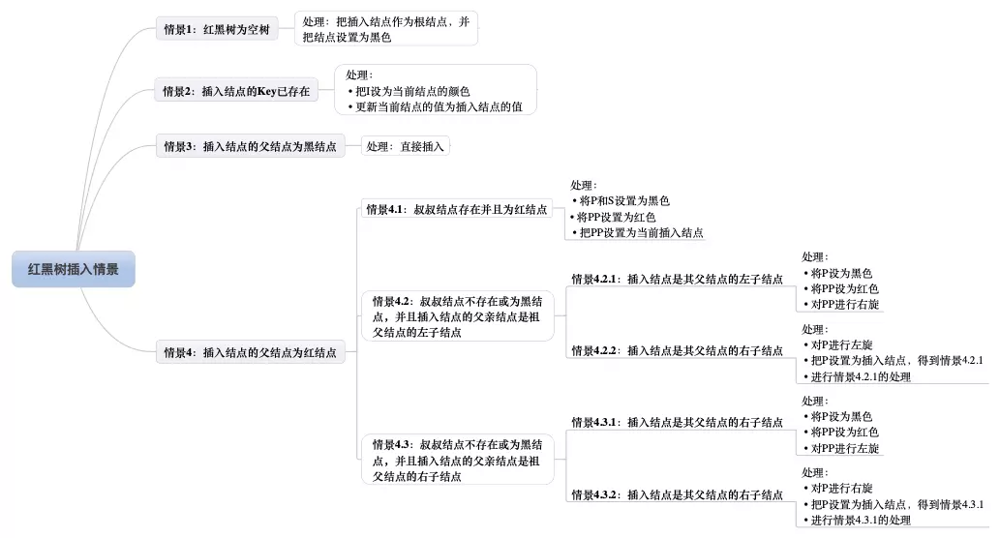

</center>

**删除**


红黑树的删除操作也包括两部分工作：一查找目标结点；而删除后自平衡。查找目标结点显然可以复用查找操作，当不存在目标结点时，忽略本次操作；当存在目标结点时，删除后就得做自平衡处理了。删除了结点后我们还需要找结点来替代删除结点的位置，不然子树跟父辈结点断开了，除非删除结点刚好没子结点，那么就不需要替代。

二叉树删除结点找替代结点有3种情情景：

- 情景1：若删除结点无子结点，直接删除
- 情景2：若删除结点只有一个子结点，用子结点替换删除结点
- 情景3：若删除结点有两个子结点，用后继结点（大于删除结点的最小结点）替换删除结点
补充说明下，情景3的后继结点是大于删除结点的最小结点，也是删除结点的右子树种最左结点。那么可以拿前继结点（删除结点的左子树最右结点）替代吗？可以的。但习惯上大多都是拿后继结点来替代，后文的讲解也是用后继结点来替代。另外告诉大家一种找前继和后继结点的直观的方法（不知为何没人提过，大家都知道？）：**把二叉树所有结点投射在X轴上，所有结点都是从左到右排好序的，所有目标结点的前后结点就是对应前继和后继结点**。如图所示。

<center>

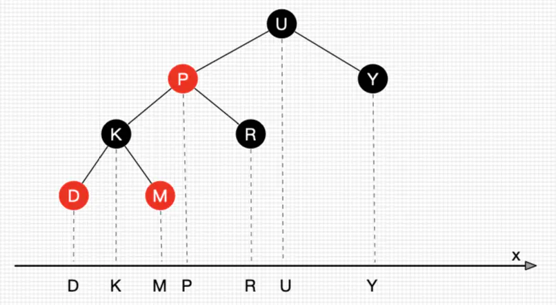

二叉树的投射x轴后有序 

</center>

接下来，讲一个重要的思路：删除结点被替代后，在不考虑结点的键值的情况下，对于树来说，可以认为删除的是替代结点！话很苍白，我们看下图。在不看键值对的情况下，下图的红黑树最终结果是删除了Q所在位置的结点！这种思路非常重要，大大简化了后文讲解红黑树删除的情景！

<center>


删除结点换位思路

</center>

基于此，上面所说的3种二叉树的删除情景可以相互转换并且最终都是转换为情景1！

- 情景2：删除结点用其唯一的子结点替换，子结点替换为删除结点后，可以认为删除的是子结点，若子结点又有两个子结点，那么相当于转换为情景3，一直自顶向下转换，总是能转换为情景1。（对于红黑树来说，根据性质5.1，只存在一个子结点的结点肯定在树末了）
- 情景3：删除结点用后继结点（肯定不存在左结点），如果后继结点有右子结点，那么相当于转换为情景2，否则转为为情景1。

二叉树删除结点情景关系图如图所示。

<center>


二叉树删除情景转换

</center>

综上所述，删除操作删除的结点可以看作删除替代结点，而替代结点最后总是在树末。有了这结论，我们讨论的删除红黑树的情景就少了很多，因为我们只考虑删除树末结点的情景了。

同样的，我们也是先来总体看下删除操作的所有情景，如图所示。

<center>


红黑树删除情景

</center>


红黑树是一种应用很广的数据结构，如在Java集合类中TreeSet和TreeMap的底层，C++STL中set与map，以及linux中虚拟内存的管理。

**思考题**

1. 黑结点可以同时包含一个红子结点和一个黑子结点吗？

答：可以。如下图的F结点：

<center>


</center>

**习题**

画出树的自平衡过程

<center>


插入节点


删除节点

</center>

### 3.4 哈夫曼树（Huffman Tree）

哈夫曼树是一种带权路径长度最短的二叉树，也称为最优二叉树。

一般可以按下面步骤构建：

1，将所有左，右子树都为空的作为根节点。
2，在森林中选出两棵根节点的权值最小的树作为一棵新树的左，右子树，且置新树的附加根节点的权值为其左，右子树上根节点的权值之和。注意，左子树的权值应小于右子树的权值。
3，从森林中删除这两棵树，同时把新树加入到森林中。
4，重复2，3步骤，直到森林中只有一棵树为止，此树便是哈夫曼树。

大家可能更多听说的是哈夫曼编码，其实就是哈夫曼树的应用。即如何让电文中出现较多的字符采用尽可能短的编码且保证在译码时不出现歧义。

<center>

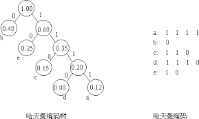

</center>

## 四、多路查找树

大规模数据存储中，实现索引查询这样一个实际背景下，树节点存储的元素数量是有限的（如果元素数量非常多的话，查找就退化成节点内部的线性查找了），这样导致二叉查找树结构由于树的深度过大而造成磁盘I/O读写过于频繁，进而导致查询效率低下。

### 4.1 B树

B树（英语：B-tree）是一种自平衡的树，能够保持数据有序。这种数据结构能够让查找数据、顺序访问、插入数据及删除的动作，都在对数时间内完成。B树，概括来说是一个一般化的二叉查找树（binary search tree），可以拥有最多2个子节点。与自平衡二叉查找树不同，B树适用于读写相对大的数据块的存储系统，例如磁盘。


1. 根结点至少有两个子女。
2. 每个中间节点都包含k-1个元素和k个孩子，其中 m/2 <= k <= m
3. 每一个叶子节点都包含k-1个元素，其中 m/2 <= k <= m
4. 所有的叶子结点都位于同一层。
5. 每个节点中的元素从小到大排列，节点当中k-1个元素正好是k个孩子包含的元素的值域分划。

<center>

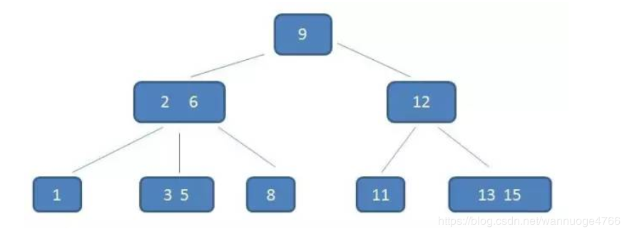

</center>

如图所示就是一颗符合规范的B树，由于相比于磁盘IO的速度，内存中的耗时几乎可以省略，所以只要树的高度足够低，IO次数足够小，就可以提升查询性能。

B树的增加删除同样遵循自平衡的性质，有旋转和换位。

B树的应用是文件系统及部分非关系型数据库索引。

### 4.2 B+树

B+ 树是一种树数据结构，通常用于关系型数据库（如Mysql）和操作系统的文件系统中。B+ 树的特点是能够保持数据稳定有序，其插入与修改拥有较稳定的对数时间复杂度。B+ 树元素自底向上插入，这与二叉树恰好相反。

在B树基础上，为叶子结点增加链表指针（B树+叶子有序链表），所有关键字都在叶子结点 中出现，非叶子结点作为叶子结点的索引；B+树总是到叶子结点才命中。

b+树的非叶子节点不保存数据，只保存子树的临界值（最大或者最小），所以同样大小的节点，b+树相对于b树能够有更多的分支，使得这棵树更加矮胖，查询时做的IO操作次数也更少。

<center>

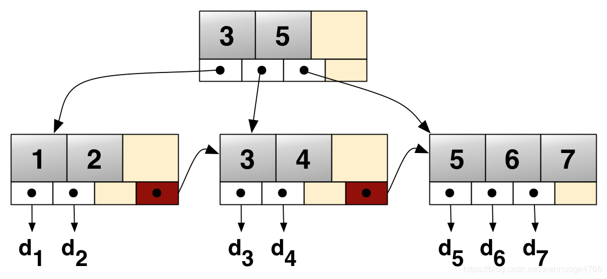

</center>

这通常在多数节点在次级存储比如硬盘中的时候出现。通过最大化在每个内部节点内的子节点的数目减少树的高度，平衡操作不经常发生，而且效率增加了。

### 4.3 B*树

B*树是B+树的变体，在B+树的非根和非叶子结点再增加指向兄弟的指针

在B+树基础上，为非叶子结点也增加链表指针，将结点的最低利用率从1/2提高到2/3。

### 4.4 R树

R树是用来做空间数据存储的树状数据结构。例如给地理位置，矩形和多边形这类多维数据建立索引。

R树的核心思想是聚合距离相近的节点并在树结构的上一层将其表示为这些节点的最小外接矩形（MBR），这个最小外接矩形就成为上一层的一个节点。因为所有节点都在它们的最小外接矩形中，所以跟某个矩形不相交的查询就一定跟这个矩形中的所有节点都不相交。叶子节点上的每个矩形都代表一个对象，节点都是对象的聚合，并且越往上层聚合的对象就越多。也可以把每一层看做是对数据集的近似，叶子节点层是最细粒度的近似，与数据集相似度100%，越往上层越粗糙。

<center>


</center>


## 参考

1. [python实现树结构](https://blog.csdn.net/m0_37324740/article/details/79435814)
2. [数据结构之树](https://blog.csdn.net/wannuoge4766/article/details/83998377)
3. [Python 数据结构 tree 树](https://blog.csdn.net/xuelians/article/details/79999284?utm_medium=distribute.pc_relevant.none-task-blog-BlogCommendFromMachineLearnPai2-4.nonecase&depth_1-utm_source=distribute.pc_relevant.none-task-blog-BlogCommendFromMachineLearnPai2-4.nonecase)
4. [Python学习笔记——树与树算法](https://blog.csdn.net/tichimi3375/article/details/81702179)
5. [树：二叉搜索树，B树，红黑树(附 python实现)](https://blog.csdn.net/qq_34216729/article/details/82796564)
6. [30张图带你彻底理解红黑树](https://www.jianshu.com/p/e136ec79235c?tdsourcetag=s_pctim_aiomsg)

