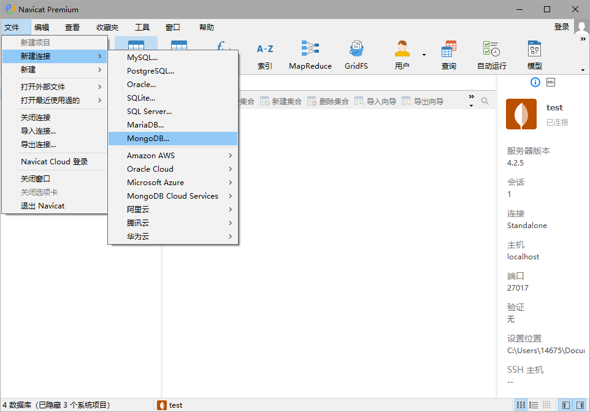
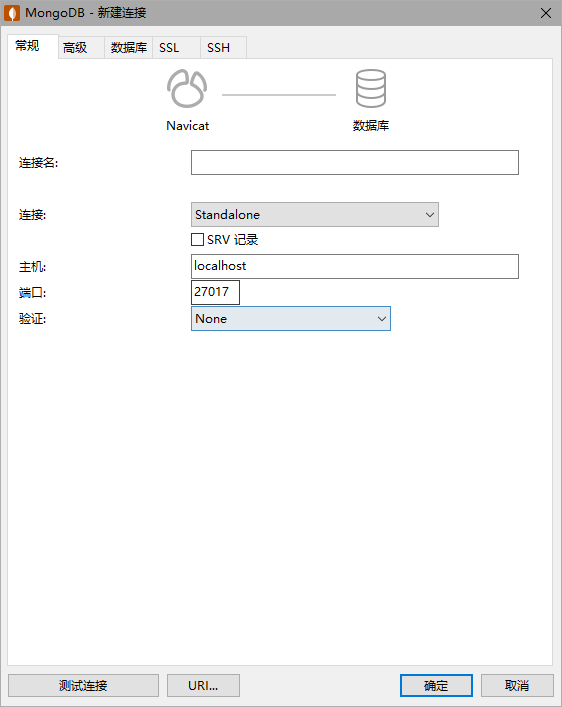
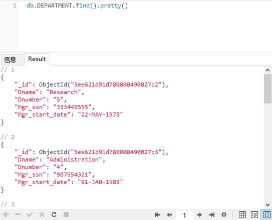
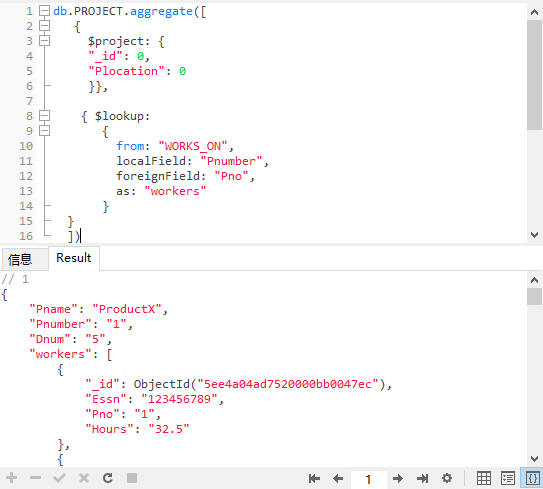

# navicat premium15使用


## 关于MySQL的一些问题

相对来说使用navicat处理MySQL的东西来说方便许多，基于navicat的特性在建表过程中很方便。

### 导入txt文件

这里可以使用navicat的导入功能对于txt文件进行导入，注意分隔符的选择以及起始行的选择。

## 关于MongoDB的一些问题
### 连接数据库
与连接MySQL相同，选择MongoDB数据库进行连接即可如果端口更改过那就记得自己修改一下,如果设置了密码的情况下需要将验证改为password。





### 导入json文件数据

这里给出命令行导入的代码。

代码如下：

```shell
mongoimport --db company --collection project --jsonArray C:\Users\14675\Desktop\project.json # 这里要填入自己文件的路径
```

-  db 是数据库的名称
- collection是集合的名字 相当于表名
- --jsonArray是有的元素是数组
- --file 如果没有数组则使用file

### MongoDB查询

navicat premium 15很好的兼容了mongodb的特性，可以建立查询，对于数据库中的数据进行查询。

下面以笔者所建立的一个名为company的数据库为例，这个数据库中包含了 EMPLOYEE, DEPARTMENT, PROJECT, WORKS_ON, DEPT_LOCATIONS五个集合，通过查询语句进行查询。

```
db.col.find().pretty() # col是要查询的集合名称
```
将col改为DEPARTMENT再次运行查询，结果如下：




```
db.PROJECT.aggregate([
   {
	   $project: { 
		 "_id": 0, 
		 "Plocation": 0 
		 }},
 
		{ $lookup:
       {
         from: "WORKS_ON",
         localField: "Pnumber",
         foreignField: "Pno",
         as: "workers"
       }
  }
	])
```

聚合查询，可以连接两个表进行联合查询，结果如下：

