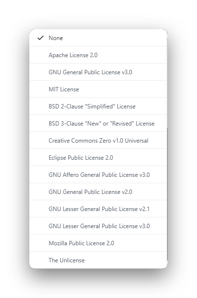
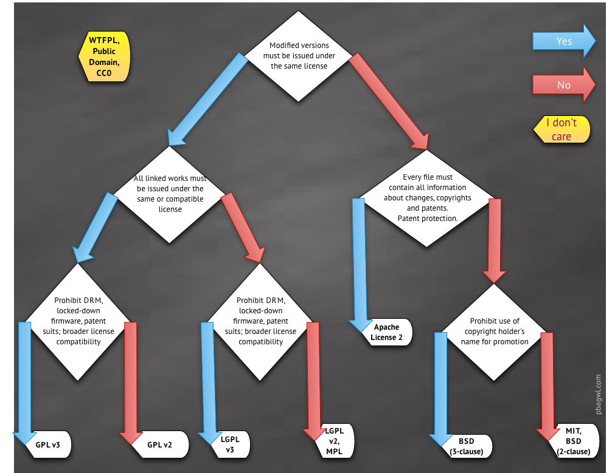

# Github仓库如何选择开源许可证

当我们点了Github个人主页右上角的那个那个加号之后,如上所示可以看到创建新仓库的选项, 点击 `New repository` , 就会进入到创建新仓库的页面,进入到这个页面之后可以看到右下角的下拉框可以为自己的项目选择开源许可证:

截至到2020/06/13日,Github在创建仓库允许选择的开源许可证如下所示:

如上图所示可以Github支持的开源许可证还是很多的 Apache, MIT, BSD, CC0, EPL, AGPL, GPL, LGPL, MPL都支持。

这样一来大大方便了我们的选择,但是有时候选择多了未必是好事情,面对开源许可证,每个人可能心中都存在过这样的疑问:
1. 为什么要使用开源许可证? 我完全不用开源许可证好像也没啥问题啊
2. 就算我打算用开源许可证,Github上面这么多,完全不知道选择那个呀? 根本不知道他们之间有啥区别?
3. Github上面的开源许可证都不是我想要的,我有了解到一个非常棒的证书,但是Github创建仓库的时候还没得选怎么办?

## 为什么需要开源许可证?
要弄懂为什么要使用开源许可证,我觉得应该首先弄懂不使用开源许可证会怎样?

## 不使用开源许可证对于开发者有何影响?
首先在没有开源许可证的情况下你对你的项目是独占版权的,这样就会造成一个问题就是别人使用你的项目比较困难, 然后就会导致没人愿意去使用你的项目,还有个问题就是 如果多人参与你的项目的开发,因为每个人都成为了这个项目的版权持有者, 你自己在没有得到团队中所有成员授权的情况下,

对项目的随意使用其实也是违法的,如果你想要很好的维护项目的其他贡献者的版权许可,那你不得不去和你的项目贡献者之间签订一个贡献者协议,

想想都是一个很头疼的事情.

其次还有个问题,就是当你把你的代码发布到Github的公共仓库的时候, 也就意味着你接受了Github公共仓库的一些服务条款,由于这些条款的存在

很多人可以去查看和复制你的项目仓库, 在一些特殊的情况下,部分人对于你的项目的使用可能不需要你的许可和授权.

## 不使用开源许可证对于项目的使用者有何影响?
如果你发现了一个软件,而这个软件没有开源许可证,那么也就意味着你没有得到作者的授权,尽管在Github上面你能够查看和复制代码,但是严格意义上你不能出于任何目的去使用,修改,和分享这个软件, 你说蛋疼不蛋疼.

此时作为一个项目的使用者你所能做的就是:
1. 和项目的开发者沟通去加上开源许可证
2. 不去使用这个没有开源许可证的项目,即使你觉得这个项目不错
3. 和开发者进行私人协商,获取开发者的授权
总结: 为什么要使用开源许可证, 因为不用的话,会给开发者和使用者带来很多的麻烦事情,
用开源许可证是为了避免日后在项目的使用过程中一些不必要的麻烦

## Github的开源许可证如何选择,他们之间有何区别?
这个世界上有太多的开源许可证,甚至Github的开源许可证就有很多,我相信大多数人都没有时间和精力去认证的去了解每一个开源许可证,那怎么办呢?

所以我这里把最主要的几个开源许可证的地址和允许的权力列了出来,大家首先做个粗判断, 简单判断一下自己可能会用到那个开源许可证,然后再去认真的研究,

如果真的对开源许可证非常感兴趣, 也可以先全研究几个被广为使用的开源许可证(比如 GPLv3和MIT许可证), 跟着潮流走总不会有啥大问题.

## 常见的软件开源许可证(开放程度由高到低)

### [GNU AGPLv3](https://choosealicense.com/licenses/agpl-3.0/)

| Permissions | Conditions | Limitations |
| :---: | :---: | :---: |
|Commercial use Distribution Modification Patent use Private use| Disclose source License and copyright notice Network use is distribution Same license State changes | Liability Warranty |

### [GNU GPLv3](https://choosealicense.com/licenses/gpl-3.0/)

| Permissions | Conditions | Limitations |
| :---: | :---: | :---: |
|Commercial use Distribution Modification Patent use Private use| Disclose source License and copyright notice Same license State changes | Liability Warranty |

### [GNU LGPLv3](https://choosealicense.com/licenses/lgpl-3.0/)

| Permissions | Conditions | Limitations |
| :---: | :---: | :---: |
|Commercial use Distribution Modification Patent use Private use| Disclose source License and copyright notice Same license State changes | Liability Warranty |

### [Mozilla Public License 2.0](https://choosealicense.com/licenses/mpl-2.0/)

| Permissions | Conditions | Limitations |
| :---: | :---: | :---: |
|Commercial use Distribution Modification Patent use Private use| Disclose source License and copyright notice Same license(file)) | Liability Trademark use Warranty |

### [Apache License 2.0](https://choosealicense.com/licenses/apache-2.0/)

| Permissions | Conditions | Limitations |
| :---: | :---: | :---: |
|Commercial use Distribution Modification Patent use Private use| Disclose source License and copyright notice | Liability Trademark use Warranty |

### [MIT License](https://choosealicense.com/licenses/mit/)

| Permissions | Conditions | Limitations |
| :---: | :---: | :---: |
|Commercial use Distribution Modification Patent use Private use| License and copyright notice | Liability Warranty |

### [Boost Software License 1.0](https://choosealicense.com/licenses/bsl-1.0/)

| Permissions | Conditions | Limitations |
| :---: | :---: | :---: |
|Commercial use Distribution Modification Patent use Private use| License and copyright notice | Liability Warranty |

### [The Unlicense](https://choosealicense.com/licenses/unlicense/)

| Permissions | Conditions | Limitations |
| :---: | :---: | :---: |
|Commercial use Distribution Modification Patent use Private use|  | Liability Warranty |

### 常见的非软件开源许可证

#### [CC0-1.0](https://choosealicense.com/licenses/cc0-1.0/)

| Permissions | Conditions | Limitations |
| :---: | :---: | :---: |
|Commercial use Distribution Modification Private use|  | Liability Warranty Patent use Trademark use |

#### [CC-BY-4.0](https://choosealicense.com/licenses/cc-by-4.0/)

| Permissions | Conditions | Limitations |
| :---: | :---: | :---: |
|Commercial use Distribution Modification Private use| License and copyright notice  State changes | Liability Warranty Patent use Trademark use |

#### [CC-BY-SA-4.0](https://choosealicense.com/licenses/cc-by-sa-4.0/)

| Permissions | Conditions | Limitations |
| :---: | :---: | :---: |
|Commercial use Distribution Modification Private use| License and copyright notice  State changes   Same license | Liability Warranty Patent use Trademark use |

## 如何看懂上面的图表
- Permissions :就是开源许可证允许做的事情
- Condition: 就是要在特定的情况下才允许做的事情
- Limitations: 就是开源许可证不允许去做的事情

## 软件开源许可证如何选择?

我们需要一张乌克兰老铁(Paul Bagwell)画的图来帮助我们进行理解和选择 :

由上图可以看到目前主流的开源证书主要分为两派:

GPL系列 和 MPL 站一派 (我简称他们A派)

BSD系列, MIT 和 Apache 站一派 (我简称他们B派)

两派之间的主要区别就是你在原有的开源软件上做了更改之后是否允许其所使用开源证书发生变化:

A派的观点就是你更改开源项目之后所使用的开源证书必须和原有开源项目保持一致或者相兼容, 其实就是一个始于开源 忠于开源的思想,让大家一直开源

B派的观点就是原有的开源项目,如果你更改了部分代码的话那你也可以更改开源证书,这样以来对于开源项目而言,就更加的容易被商业化,

而GPLv3和MIT 这两个开源证书简直就是A派和B派的两个极端, 也是目前最受欢迎的两个证书,具体怎么选择大家可以看图行事.

## 非软件开源许可证如何选择?

**数据集 视频 所使用的开源许可证**

CC0-1.0, CC-BY-4.0, 和 CC-BY-SA-4.0 这三种开源许可证就经常被用在数据集和视频 等非软件的项目上面,有一点需要注意的就是 CC-BY-4.0 和 CC-BY-SA-4.0 这两种许可证是不建议给软件项目用的CC-BY-4.0 和 CC-BY-SA-4.0非常的相似,后者比前者有一项要求就是,如果你对开源项目进行了更改,那么更改后的版本所使用的开源协议必须和原有协议相同或者想兼容,这里和软件开源证书的两派的思想是相同的

**文档所使用的开源许可证**

一般情况下开源软件中所附带的开源的文档和 开源软件本身持有相同的开源许可证,当然你也可以针对开源软件和其对应的开源文档使用两套不同的开源许可证,但是你一定要指出文档中的 源代码示例 所使用的许可证是什么类型的

**字体使用的开源许可证**

针对开源字体常用的许可证就是 SIL Open Font License 1.1 ,
这个许可证可以允许别人自由的去使用它,同时保留自己的版权

**混合工程使用的许可证**

如果你的 项目是个非常大的混合工程,包含 软件, 文档, 数据集,视频,字体等内容, 那你就需要为自己的项目准备多个许可证,但是你需要做一个说明,用来说明你的工程的各个部分分别使用怎样的许可证 .

## 如果Github上面的所有许可证都不能满足我的要求怎么办?

开源许可证本质上就是一个名字为LICENSE或者LICENSE.txt的文本文件

如果你将要使用的开源许可证不可以在Github上建立仓库的时候进行选择,那么你可以这么做:

1. 在选择开源许可证的时候随便选择一个,然后把自动生成的LICENSE中的文件更改为你所需要的内容
2. 直接不选择开源许可证,在自己的项目文件夹中自己去创建 LICENSE/LICENSE.txt文件 然后把自己所使用的开源许可证的协议内容粘贴进去

[原文链接](https://www.cnblogs.com/zaoshuimang/p/13127049.html#%E6%95%B0%E6%8D%AE%E9%9B%86-%E8%A7%86%E9%A2%91--%E6%89%80%E4%BD%BF%E7%94%A8%E7%9A%84%E5%BC%80%E6%BA%90%E8%AE%B8%E5%8F%AF%E8%AF%81)