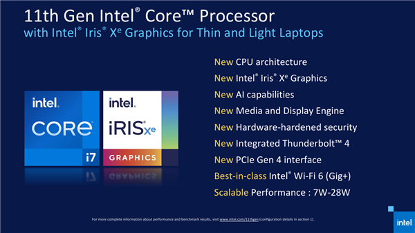
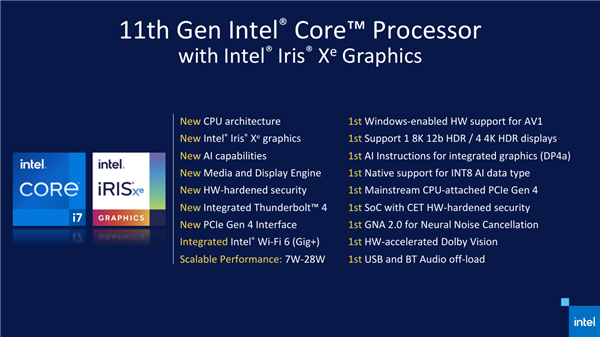
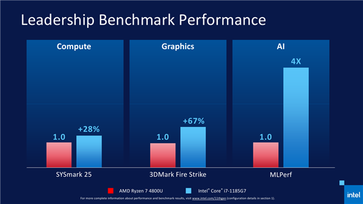

# 这一次真的是10nm了，新一代酷睿处理器上市！

> 每年的九月份算是发布会最多的时候了，前天刚刚看完了令众多20系显卡心痛的NVIDIA发布会，英特尔这边也有了新的动静。

在今年年初的时候把手里用了快四年的Surface Pro4出了换了Surface Pro7，也体验了10nm的Ice Lake架构的处理器。本以为这一次英特尔终于更新了制程，然而因为产能不足和时钟频率低等原因，英特尔最后被迫发布[Comet Lake微架构](https://zh.wikipedia.org/wiki/Comet_Lake微架构)（没错又是14nm，不对应该是14nm++++），所以除了型号为ix-10xxGx的处理器之外其他的移动端和桌面端的处理器还是使用的14nm。

然后9月2日终于发布了真正的10nm芯片——**Tiger Lake**，**Tiger Lake**是[英特尔](https://zh.wikipedia.org/wiki/英特尔)第11代[酷睿](https://zh.wikipedia.org/wiki/酷睿)移动处理器的代号，采用英特尔第三代[10纳米制程](https://zh.wikipedia.org/wiki/10纳米制程)制造。Tiger Lake将取代上一代的[Ice Lake微架构](https://zh.wikipedia.org/wiki/Ice_Lake微架构)系列移动处理器。

> **解释一下为什么是第三代？**
>
> [英特尔](https://zh.wikipedia.org/wiki/英特尔)于2018年推出了第一款10nm制程的处理器，采用**Cannon Lake微架构**。 但此微架构仅有一款笔电处理器——i3-8121U。由于预期性能及研发难度超越他厂的同名称制程，因此桌上电脑和服务器级处理器推迟至2020年以后。2019年第三季，英特尔推出了第二代10nm制程处理器，采用[Ice Lake微架构](https://zh.wikipedia.org/wiki/Ice_Lake微架构)。这次发表的处理器全部是笔电处理器。

与第二代10nm制程不同的是，这一次改良的10nm制程加入了全新的**SuperFin晶体管技术**，这个技术号称可以带来媲美完全节点转换的性能提升。

## 让我们看看这次牙膏挤的多不多

**CPU方面**采用的是全新的Willow Cove架构，最多4c8t(4核心8线程)，最好频率达到了4.8GHz，相比于上一代采用Ice Lake架构的十代酷睿中的Sunny Cove的3.9GHz有这巨大的提升（不算20年第二季度的i7-1068NG7）。一方面得益于架构的升级，另一方面则得益于 SuperFin工艺技术。

GPU核显方面采用的全新的$ X^e $-LP，这是$ X^e $-LP架构的首次登场，属于低功耗版本，最多有96个EU执行单元，性能提升最高可达2倍，并支持深度学习加速指令DP4A，可以加速AI应用。

**内存方面**也得到了升级，内存最多支持**32GB LPDDR4/4X-4266、64GB DDR4-3200**，未来还将支持**LPDDR5-5400**，并具备Intel全内存加密技术。

在连接性方面首次原生支持PCIe 4.0（上篇文章就说英特尔这次在不支持4.0就说不过去了），独立显卡或者SSD均可使用该插槽。首次支持USB4、雷电4，完整集成了4x DP/USB/PCIe，每个端口最高40Gbps的双向带宽。

多媒体与显示部分，具备两个MEDIA编码器，最高支持4K60fps 10-bit、8K30fps 10bit，并有四条显示流水线，最高可以输出给单台8K60Hz或者四台4K60Hz屏幕。支持DisplayPort 1.4 HBR3、BT.2020，还有**IPU6图像处理单元**，最高支持4K90fpf分辨率视频、4200万像素照片(初期支持4K30fps、2700万像素)。

AI方面，集成新的**高斯网络加速器GNA 2.0**，与NPU的作用相似，只需很低的功耗和CPU占用率，就可以高效进行神经推理计算。

$ X^e $-LP核显具备了高效线程控制、8宽度适量单元、EUs数量从64增加到了96（以i7为例，增长了50%）、端到端压缩、VRS可变着色率，每时钟周期最多处理24个像素、48个纹理。

**FP16、FP32浮点性能提升84％的同时，还首次加入了INT8整数处理能力，性能8.29TOPS。**

值得注意的是，除了硬件改进，**Intel这次也非常重视驱动和应用软件建设，比如彻底重写了DX11驱动，过载更低，同时支持游戏锐化、配置优化、即时游戏调校**，自然可以更好地发挥硬件性能潜力，官方修成可在1080p分辨率下流畅运行大部分游戏。

配套芯片组方面，集成**Gig+ Wi-Fi 6**(AX201)、FIVR(全集成电压稳压器)和DVFS(动态电压与频率调节)、可编程四核音频DSP(低功耗语音唤醒/USB和蓝牙音频)、第四代CSME(改进加解密和侧信道防护)、触摸主控(低功耗/触摸和手写笔同步)，IO则支持4个USB 3.0、10个USB 2.0、12条PCIe 3.0、2个SATA 6Gbps、8个GPIO。

Intel 11代酷睿低功耗版首发共有11款型号，可分为两个系列，其中**数字编号5结尾的热设计功耗12-28W，0结尾的则是7-15W，都不再局限于一个静态的功耗级别，而是整颗SoC在一个范围内，根据实际场景需求而实时动态调整，笔记本设计也更加灵活。**

Intel推荐，7-15W的可用于12-13寸的无[风扇](https://c.duomai.com/track.php?site_id=242986&euid=&t=https%3A%2F%2Flist.jd.com%2Flist.html%3Fcat%3D737%2C738%2C751)静音超轻薄本，12-28W的则适合14-15寸的主动散热轻薄本、轻薄游戏本或设计本。

相比之下，Ice Lake 10代酷睿中编号8、5、0结尾的分别固定对应28W、15W、9W。

总结一下型号命名与规格的一些规律：

1、**i7系列4核心8线程、12MB三级缓存，i5系列4核心8线程、8MB三级缓存，i3系列2核心4线程、6MB三级缓存，但明年会有新变化。**

2、内存支持，**12-28W版本同时支持DDR4-3200、LPDDR4X-4266(i7)/3377(i5/i3)，7-15W版本则只支持LPDDR4X-4266。**

3、核显级别，**i7系列都是G7 96个单元，i5系列都是G7 80个单元，i3系列都是G4 48个单元**，不再有G1级别。

4、核显频率，**12-28W版本的1.25-1.3GHz不等，7-15W版本的则统一1.1GHz。**

**旗舰型号预计也将最常看到的是i7-1185G7，基准频率就有3.0GHz，全核睿频4.3GHz，单核睿频达到了4.8GHz，核显频率也有1.35GHz**，此前消息显示可以超频到1.6GHz，但暂时不清楚具体如何超。

**i7-1165G7** CPU频率降低至2.8/4.1/4.7GHz，核显频率降至1.3GHz。

**i5-1135G7** CPU频率继续大幅度降至2.4/3.8/4.2GHz。

**i3-1115G4** CPU频率基准反而是最高的3.0GHz，全核、单核睿频则都是4.1GHz，核显频率为1.25GHz。

**7-15W版本的旗舰型号是i7-1160G7，CPU频率1.2/3.6/4.4GHz**。**i5-1130G7**频率降低至1.1/3.4/4.0GHz，**i3-1110G4**基准频率是该系列中最高的1.8GHz，全核、单核睿频都是3.9GHz。

另外，**明年还会增加两个特殊的i3，居然都是4核心8线程，一个是i3-1125G4 2.0/3.3/3.7GHz，一个是i3-1110G4 1.1/3.0/3.5GHz。**

## 接下来，对比下上一代冰湖（Ice Lake）架构

因为自己用的就是i5-1035G4的surface Pro7所以想看看变化大不大。

下面是我在英特尔官方找的到配置信息，上面的是采用Tiger Lake的11代酷睿，下面是采用Ice Lake的10代酷睿。

可以看到在CPU方面，11代酷睿得益于架构的重新设计和新技术几乎所有规格的睿频都达到了4GHz分段，反观10代酷睿几乎都在3GHz分段，并且三级缓存也得到了提升。在核显方面，由于EUs数量的增加，核显方面的增加也是巨大的。

## 再看看和AMD处理器的对比

Intel还直接拿i7-1185G7和锐龙 4800U进行对比，官方称经过基准测试，前者比后者在计算性能方面高28%，图形性能高64%，AI性能高4倍。GPU性能方面，Intel也做出了实测，在1080P下，3A大作普遍能超过30fps，轻量级游戏可以超过60fps，有些电竞游戏甚至能在100fps以上，相比于上一代10代酷睿性能提升至少50%，最高可达2倍，相比于MX350也当仁不让。

与AMD的对比，性能方面实现了超越。

同时，Intel现在更强调应用的实际性能，工作、创作、游戏等方面都是全方位碾压。

AI也是Intel全力投入、大力推广的一个方面，为此加入了DP4A、VNNI专用指令集，以及单独的GNA 2.0模块，隔壁AMD这方面还基本是零。

在CPU方面，官方声称28w时比15w时性能可多释放33%-37%。

11代的28w极限状态相比于10代的25w极限状态，性能可以领先10%-30%，同时可以碾压极限性能模式的锐龙。

电源供电的性能损耗也减小，只有大约5%，AMD高达38%（这么高的吗）。

这次，Intel在显卡方面做出了巨大的提升，并且有迹象表明，Xe显卡预计将支持光线追踪（amazing），并预计在2021年推出。

## 再唠叨两句

看着手里的surface Pro7，唉，太难了，不过电子产品就是这样了，早买早享受了（嘶哑）。

最后不得不感叹一下，我AMD太难了，前有NVIDIA，后有Intel，不过这也让我们更加坚定地说出那句话：**AMD，yes！**

### 本文参考：

1. [Tiger_Lake微架构]([https://zh.wikipedia.org/wiki/Tiger_Lake%E5%BE%AE%E6%9E%B6%E6%9E%84](https://zh.wikipedia.org/wiki/Tiger_Lake微架构))
2. [10纳米制程]([https://zh.wikipedia.org/wiki/10%E7%BA%B3%E7%B1%B3%E5%88%B6%E7%A8%8B](https://zh.wikipedia.org/wiki/10纳米制程))
3. [Ice_Lake微架构](https://zh.wikipedia.org/wiki/Ice_Lake微架构)
4. [Intel 11代酷睿正式发布 近年来最大的一次飞跃](https://www.cnbeta.com/articles/tech/1023949.htm)
5. [Intel官方参数](https://ark.intel.com/content/www/cn/zh/ark.html#@PanelLabel122139)

